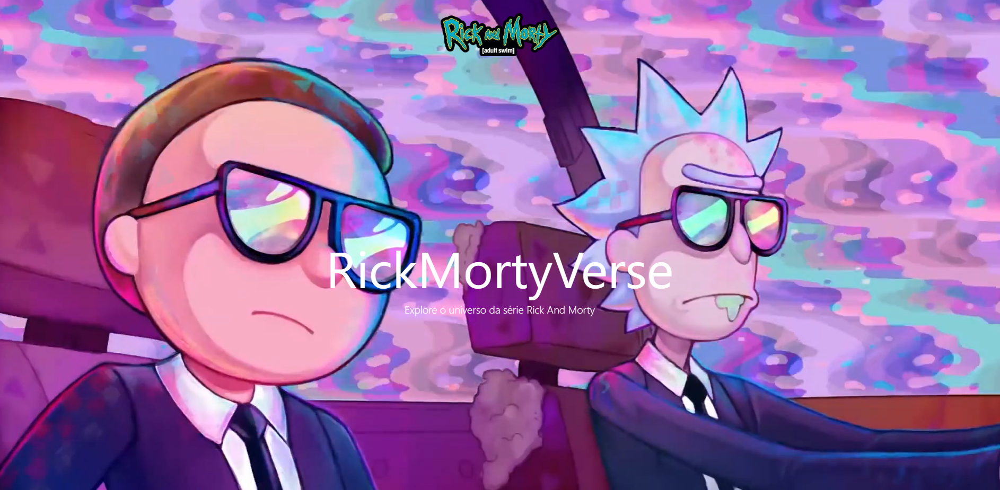

<figure class="col-span-1 sm:col-span-1">
    
  </figure>
  

    <strong>Homepage desenvolvida utilizando as tecnologias:</strong> Html,
  Tailwind e JavaScript.
  

  

    <strong>Design:</strong> Responsivo, utilizado Tailwind puro.
  

  

    <strong>API Rest:</strong> Consumo da API pública Rick and Morty.
  

  

    <strong>Funcionalidades / Interatividade:</strong> Função fetch, método 

  JSON, Js puro.  
  

  

    Desenvolvido com❤️por: <strong>Daiane Lima</strong>
  

